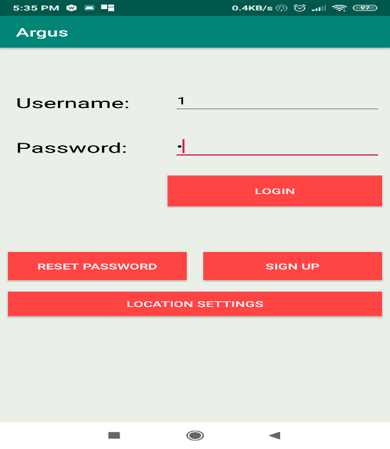
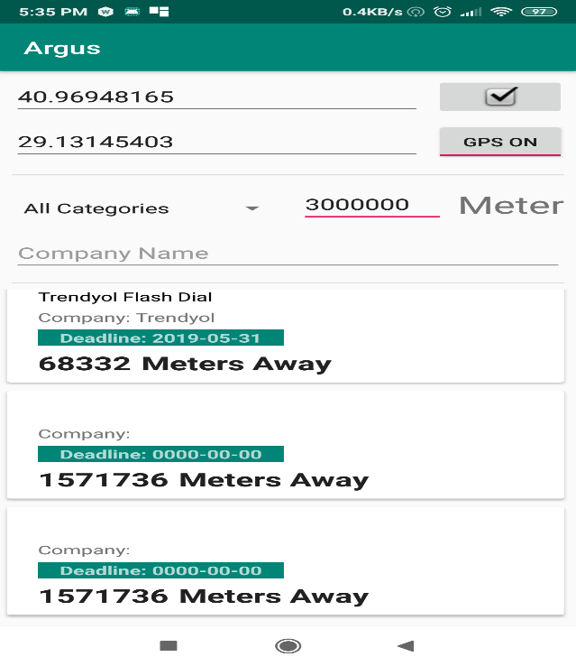
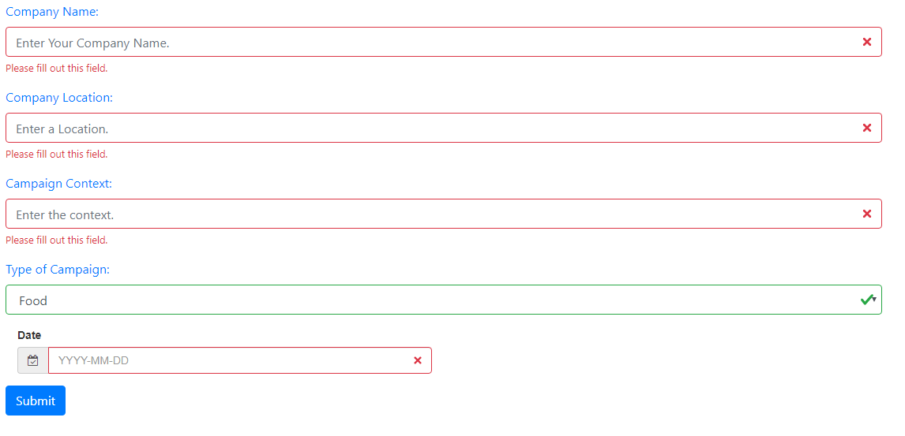

# Argus

    

        
        
    

    

        
    

## Description
This project; It receives a campaign record through an interface, these records are transferred to the database and these data are pulled through a mobile service via the mobile application and delivered to the end user through the mobile interface. During this transportation, the GPS coordinates of the user are accessed over the phone and the required campaigns are drawn by the remote Amazon Web Services (AWS) server and displayed live to the user with a certain range or other filtering tools entered by the user.

## Usage

You can run PHP codes with WAMP, Java codes with Android Studio.

## Contributing
Pull requests are welcome. For major changes, please open an issue first to discuss what you would like to change.

Please make sure to update tests as appropriate.

## Authors
:bust_in_silhouette: [Mehmet Fırat KÖMÜRCÜ](https://github.com/MehmetFiratKomurcu)

:bust_in_silhouette: [Ali Recep KARACA](https://github.com/recepkaraca)

## Project Status

This is our school project.